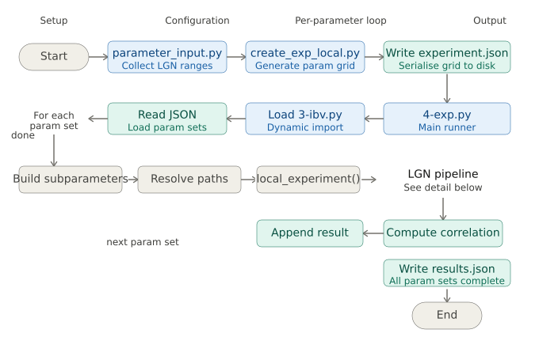
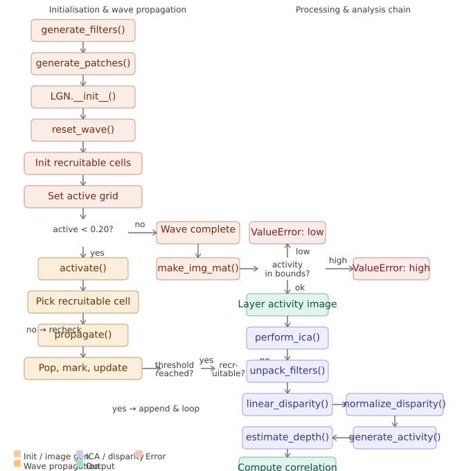

# Innate Binocular Vision

This repository contains code and scripts for running the Innate Binocular Vision experiments.

## Quick Start (First Clone)

### 1. Clone and enter the repository

```bash
git clone <your-repo-url>
cd innate-binocular-vision
```

### 2. Create a virtual environment and install dependencies

Linux/macOS:

```bash
python3 -m venv .venv && ./.venv/bin/python -m pip install -r requirements.txt
```

If this fails on Debian/Ubuntu with an ensurepip or venv error, install the system package first:

```bash
sudo apt-get update && sudo apt-get install -y python3.12-venv
```

Windows (PowerShell):

```powershell
py -m venv .venv; .\.venv\Scripts\python -m pip install -r requirements.txt
```

## VS Code Task (One Click Setup)

A setup task is already included in [.vscode/tasks.json](.vscode/tasks.json).

In VS Code:
1. Open the Command Palette using View > Command Palette, or press F1.
2. Run Tasks: Run Task.
3. Choose Setup venv from requirements.

If the task does not appear, make sure the repository folder is opened as a VS Code workspace and reload the window once.

## Run the Project

### Option A: Run the experiment workload script

```bash
./.venv/bin/python 4-exp.py
```

### Generate experiment JSON

```bash
./.venv/bin/python 2-create_exp_local.py -la 0.05 0.5 5 -lr 1 4 4 -lp 0.1 1 5 -lt 1 10 10
```

### Option C: Use the parameter CLI helper

```bash
./.venv/bin/python 1-parameter_input.py
  -la 0.05 0.5 5 -lr 1 4 4 -lp 0.1 1 5 -lt 1 10 10
```

### Run workload

```bash
./.venv/bin/python 4-exp.py --experiment-file experiment1.json --output workload_results.json
```

### Clean generated files

```bash
./.venv/bin/python clean_experiment_files.py --dry-run
./.venv/bin/python clean_experiment_files.py
```

## LGN Visuals

Pipeline overview:



Internal detail:



## Notes

- The project imports code from [3-ibv.py](3-ibv.py).
- Dependencies are listed in [requirements.txt](requirements.txt).
- The virtual environment folder .venv is ignored by git via [.gitignore](.gitignore).
- Scripts are now CLI-first and use portable paths for Linux/macOS/Windows.

## Troubleshooting

### ModuleNotFoundError: No module named PIL (or numpy/scipy/sklearn/etc.)

This means dependencies are not installed in the active virtual environment.

Linux/macOS:

```bash
python3 -m venv .venv && ./.venv/bin/python -m pip install -r requirements.txt
```

Windows (PowerShell):

```powershell
py -m venv .venv; .\.venv\Scripts\python -m pip install -r requirements.txt
```

### pip is missing in the virtual environment

If you see an error like pip not installed, bootstrap pip and retry:

Linux/macOS:

```bash
./.venv/bin/python -m ensurepip --upgrade && ./.venv/bin/python -m pip install -r requirements.txt
```

Windows (PowerShell):

```powershell
.\.venv\Scripts\python -m ensurepip --upgrade; .\.venv\Scripts\python -m pip install -r requirements.txt
```

### Virtual environment creation fails with ensurepip is not available

On Debian/Ubuntu, install the venv package first, then rerun the setup command:

```bash
sudo apt-get update && sudo apt-get install -y python3.12-venv
```

If your distro uses a different Python version package, the package may be named `python3-venv` instead.

### python command not found

Use python3 (Linux/macOS) or py (Windows) instead of python.

### Verify imports after setup

Linux/macOS:

```bash
./.venv/bin/python -c "import importlib.util, pathlib; p = pathlib.Path('3-ibv.py').resolve(); s = importlib.util.spec_from_file_location('ibv', p); m = importlib.util.module_from_spec(s); s.loader.exec_module(m); print(m.__file__)"
```

Windows (PowerShell):

```powershell
.\.venv\Scripts\python -c "import importlib.util, pathlib; p = pathlib.Path('3-ibv.py').resolve(); s = importlib.util.spec_from_file_location('ibv', p); m = importlib.util.module_from_spec(s); s.loader.exec_module(m); print(m.__file__)"
```

If successful, this prints the path to [3-ibv.py](3-ibv.py).
